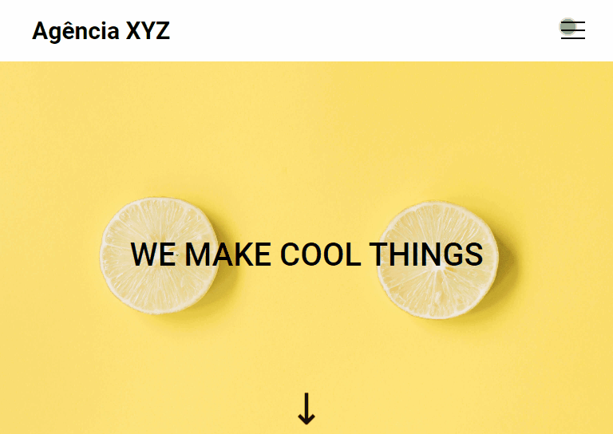
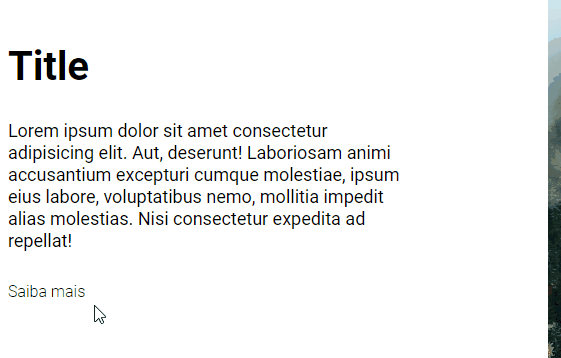
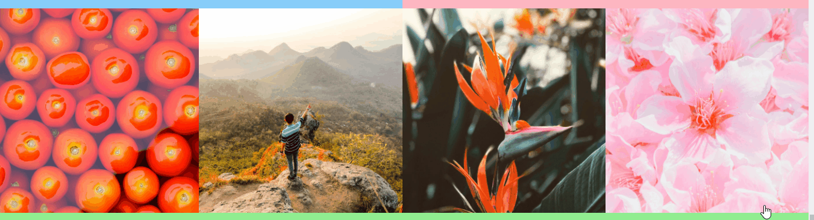
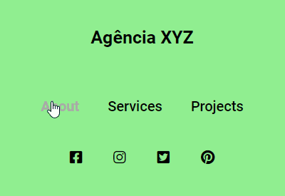

# Landing Page com Grid e Flex
Esse projeto é uma landing page de uma agência de viagens, foi desenvolvido no curso do Dev Em Dobro, o DevQuest.

# Tecnologias utilizadas
- HTML;
- CSS.

# Interações da página
Começando pelo cabeçalho que tem um título clicável, um menu com botões que te levam para a seção escolhida na página, os botões mudam quando o cursor do mouse passa por eles.

Dependendo do tamanho da tela, é criado um menu "hamburguer", que abre e fecha o menu.

Na seção About, um botão saiba mais que muda o peso da fonte caso passe o cursor do mouse.

Na seção Projects, as imagens são clicáveis e ficam com uma leve opacidade caso passar o cursor do mouse.

Na seção Contacts, há um menu de navegação da página e também alguns ícones de redes sociais usando o Font Awesome, ao passar o cursor do mouse em cima deles, a cor muda.

